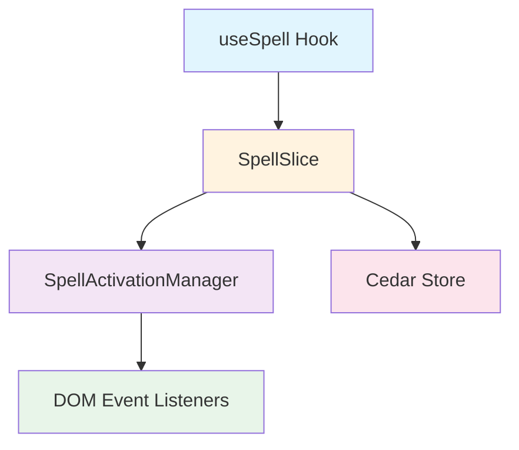
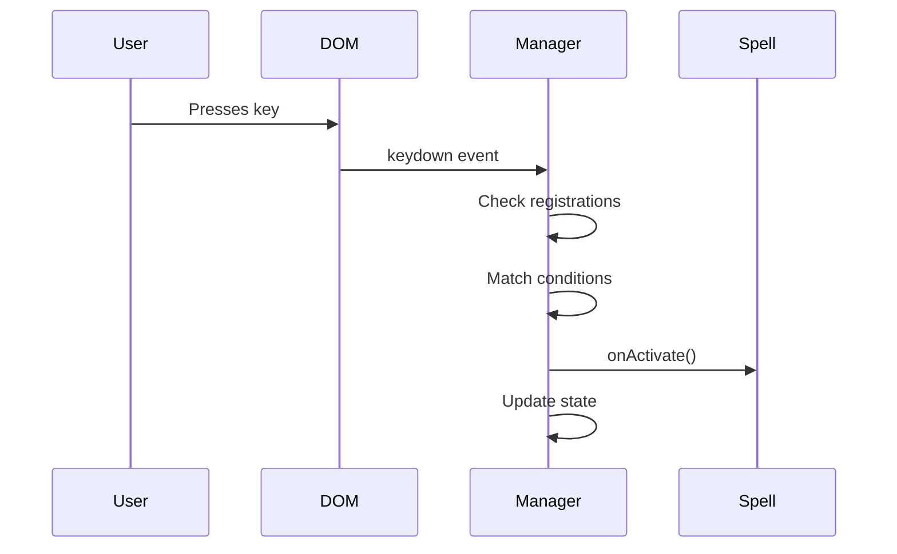
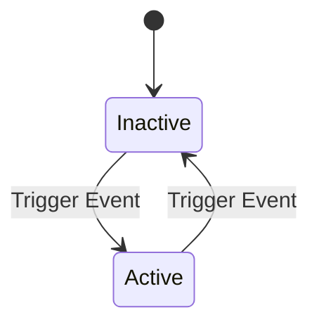
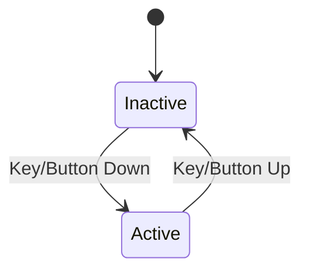
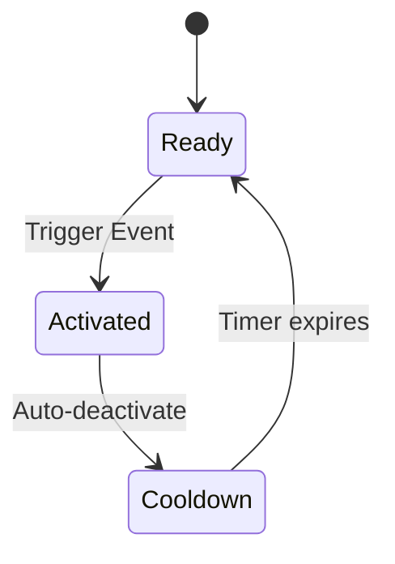
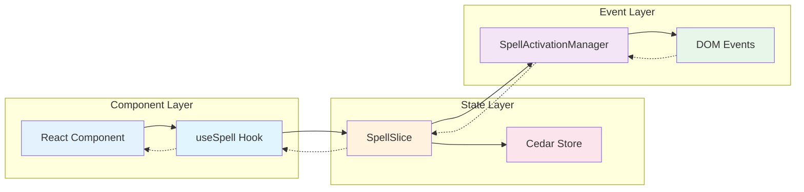

# Spell Architecture

This guide provides a deep dive into the technical architecture of Cedar-OS's spell system, explaining how spells work under the hood and how the various components interact.

## Architecture Overview

The spell system consists of three main components working in harmony:



1. **useSpell Hook** - React interface for components
2. **SpellSlice** - State management and coordination
3. **SpellActivationManager** - Event handling and routing

## Component Deep Dive

### 1. SpellActivationManager

The `SpellActivationManager` is a singleton class that manages all low-level event handling for spells. It's the bridge between DOM events and spell activations.

#### Key Responsibilities

- **Centralized Event Listening**: Maintains a single set of event listeners for all spells
- **Event Routing**: Routes events to the appropriate registered spells
- **Activation Logic**: Handles different activation modes (toggle, hold, trigger)
- **Performance Optimization**: Prevents duplicate listeners and manages cleanup

#### How It Works

```tsx
class SpellActivationManager {
	// Singleton pattern ensures one instance
	private static instance: SpellActivationManager;

	// Map of spell IDs to their configurations
	private registrations = new Map<string, SpellRegistration>();

	// Bound event handlers for proper cleanup
	private boundHandlers = {
		keydown: this.handleKeyDown.bind(this),
		keyup: this.handleKeyUp.bind(this),
		// ... other handlers
	};
}
```

The manager listens to various DOM events and processes them:

1. **Event Detection**: Captures keyboard, mouse, and selection events
2. **Spell Matching**: Checks which registered spells should respond
3. **State Management**: Tracks held keys, cooldowns, and active states
4. **Callback Execution**: Triggers appropriate spell callbacks

#### Event Processing Flow



### 2. SpellSlice

The `SpellSlice` is a Zustand store slice that provides high-level spell management and integrates with Cedar's state system.

#### Core State Structure

```tsx
interface SpellSlice {
	// Map of spell configurations and states
	spells: Partial<SpellMap>;

	// Registration and management methods
	registerSpell: (registration: SpellRegistration) => void;
	unregisterSpell: (spellId: string) => void;
	activateSpell: (spellId: string, triggerData?: any) => void;
	deactivateSpell: (spellId: string) => void;
	toggleSpell: (spellId: string) => void;
	clearSpells: () => void;
}
```

#### Integration Points

The SpellSlice acts as the coordination layer:

1. **Store Integration**: Provides access to Cedar store for spell callbacks
2. **Lifecycle Management**: Handles spell registration/unregistration
3. **State Synchronization**: Keeps UI state in sync with activation manager
4. **Programmatic Control**: Enables manual spell activation/deactivation

#### Registration Flow

When a spell is registered:

```tsx
registerSpell: (registration) => {
	// 1. Add to store state
	set((state) => ({
		spells: {
			...state.spells,
			[id]: { isActive: false, registration },
		},
	}));

	// 2. Register with activation manager
	manager.register(id, conditions, {
		onActivate: (state) => {
			// Update store state
			// Call user callback
		},
		onDeactivate: () => {
			// Update store state
			// Call user callback
		},
	});
};
```

### 3. useSpell Hook

The `useSpell` hook provides the React-friendly interface for components to use spells.

#### Hook Lifecycle

```tsx
function useSpell(options: UseSpellOptions) {
  // 1. Get store methods
  const { registerSpell, unregisterSpell, ... } = useSpells();

  // 2. Use refs for callbacks to avoid re-registration
  const onActivateRef = useRef(options.onActivate);
  const onDeactivateRef = useRef(options.onDeactivate);

  // 3. Register on mount, re-register on condition changes
  useEffect(() => {
    registerSpell({
      id: options.id,
      activationConditions: options.activationConditions,
      onActivate: (state) => onActivateRef.current?.(state),
      onDeactivate: () => onDeactivateRef.current?.()
    });

    // 4. Cleanup on unmount
    return () => {
      unregisterSpell(options.id);
    };
  }, [/* dependencies */]);

  // 5. Return current state and controls
  return { isActive, activate, deactivate, toggle };
}
```

#### Performance Optimizations

- **Ref-based Callbacks**: Prevents unnecessary re-registrations
- **Dependency Tracking**: Only re-registers when conditions change
- **Automatic Cleanup**: Ensures no memory leaks

## Activation Modes Explained

### Toggle Mode



- User presses key/button → spell activates
- User presses again → spell deactivates
- Good for persistent UI elements

### Hold Mode



- Activates on keydown/mousedown
- Deactivates on keyup/mouseup
- Perfect for temporary overlays

### Trigger Mode



- Fires once when triggered
- Auto-deactivates after brief period
- Optional cooldown prevents spam

## Event Processing Details

### Keyboard Event Handling

The system handles both single keys and combinations:

```tsx
private matchesHotkey(event: KeyboardEvent, hotkey: string): boolean {
  if (hotkey.includes('+')) {
    // Combination like "ctrl+k"
    const combo = this.parseHotkeyCombo(hotkey);
    return event.key === combo.key &&
           event.ctrlKey === combo.modifiers.ctrl &&
           event.metaKey === combo.modifiers.meta;
  } else {
    // Single key - no unexpected modifiers
    return event.key.toLowerCase() === hotkey.toLowerCase() &&
           !event.ctrlKey && !event.metaKey && !event.altKey;
  }
}
```

### Mouse Event Handling

Mouse events include position tracking:

```tsx
private handleContextMenu(event: MouseEvent): void {
  for (const registration of this.registrations.values()) {
    if (mouseEvents.includes(RIGHT_CLICK)) {
      this.activateSpell(registration, {
        type: 'mouse',
        event: RIGHT_CLICK,
        mousePosition: { x: event.clientX, y: event.clientY },
        originalEvent: event
      });
    }
  }
}
```

### Selection Event Handling

Text selection is debounced for performance:

```tsx
private handleSelectionChange(): void {
  // Clear previous timeout
  if (this.selectionTimeout) {
    clearTimeout(this.selectionTimeout);
  }

  // Debounce selection events
  this.selectionTimeout = setTimeout(() => {
    const selection = window.getSelection();
    const selectedText = selection?.toString().trim();

    if (selectedText && selectedText.length > 0) {
      // Activate selection-based spells
    }
  }, 200); // 200ms debounce
}
```

## Performance Considerations

### Event Listener Management

The system uses a single set of listeners for all spells:

```tsx
// ✅ Efficient: One listener for all spells
window.addEventListener('keydown', this.boundHandlers.keydown);

// ❌ Inefficient: Listener per spell
spells.forEach((spell) => {
	window.addEventListener('keydown', spell.handler);
});
```

### Memory Management

- **Singleton Pattern**: One manager instance for entire app
- **Automatic Cleanup**: Listeners removed when no spells registered
- **Ref-based Callbacks**: Prevents closure memory leaks

### React Integration

The hook optimizes React re-renders:

```tsx
// Dependencies are stringified for deep comparison
useEffect(() => {
  registerSpell({...});
}, [
  options.id,
  JSON.stringify(options.activationConditions), // Deep comparison
  options.preventDefaultEvents,
  options.ignoreInputElements
]);
```

## Advanced Features

### Input Element Handling

Spells can be configured to ignore input elements:

```tsx
private isInputElement(target: EventTarget | null): boolean {
  if (!ignoreInputElements) return false;
  return target.closest('input, textarea, [contenteditable="true"]') !== null;
}
```

### Cooldown System

Prevents rapid re-triggering:

```tsx
if (mode === ActivationMode.TRIGGER) {
	const now = Date.now();
	if (now - registration.lastTriggerTime < cooldown) {
		return; // Still on cooldown
	}
	registration.lastTriggerTime = now;
}
```

### Multi-Event Support

Spells can respond to multiple triggers:

```tsx
activationConditions: {
	events: [Hotkey.SPACE, MouseEvent.RIGHT_CLICK, 'ctrl+enter'];
}
// Any of these will activate the spell
```

## Data Flow Diagram



## Best Practices for Performance

### 1. Use Appropriate Activation Modes

```tsx
// Hold mode for temporary UI
mode: ActivationMode.HOLD; // Auto-cleanup on release

// Toggle for persistent features
mode: ActivationMode.TOGGLE; // User controls lifecycle

// Trigger for one-time actions
mode: ActivationMode.TRIGGER; // Auto-cleanup after execution
```

### 2. Optimize Spell IDs

```tsx
// Use stable IDs to prevent re-registration
const SPELL_ID = 'my-feature-spell'; // Constant

// Avoid dynamic IDs that change
const spellId = `spell-${Date.now()}`; // ❌ Changes every render
```

### 3. Leverage Refs for Callbacks

```tsx
// The hook already does this, but for custom implementations:
const callbackRef = useRef(callback);
useEffect(() => {
	callbackRef.current = callback;
}, [callback]);
```

### 4. Consider Event Delegation

For many similar spells, consider a single parent spell:

```tsx
// Instead of 100 tooltip spells
items.map(item => <TooltipSpell key={item.id} />)

// Use one spell with delegation
<TooltipManagerSpell items={items} />
```

## Debugging Spells

### Enable Debug Logging

```tsx
const { isActive } = useSpell({
	id: 'debug-spell',
	onActivate: (state) => {
		console.log('Spell activated:', {
			triggerData: state.triggerData,
			timestamp: Date.now(),
		});
	},
});
```

### Monitor Registration

```tsx
// Check registered spells in Cedar store
const { spells } = useCedarStore();
console.log('Active spells:', Object.keys(spells));
```

### Track Event Flow

Add logging to understand event propagation:

```tsx
onActivate: (state) => {
	console.log('Trigger:', state.triggerData?.event);
	console.log('Mouse position:', state.triggerData?.mousePosition);
	console.log('Original event:', state.triggerData?.originalEvent);
};
```

## Summary

The spell architecture provides a robust, performant system for gesture-based interactions:

- **Centralized Management**: Single manager handles all events efficiently
- **React Integration**: Hooks provide clean component interface
- **State Synchronization**: Zustand slice keeps everything in sync
- **Performance Optimized**: Singleton pattern, ref-based callbacks, debouncing
- **Flexible Activation**: Multiple modes and event types supported

This architecture ensures spells are both powerful for developers and performant for users, enabling truly magical interactions in your Cedar-OS applications.
