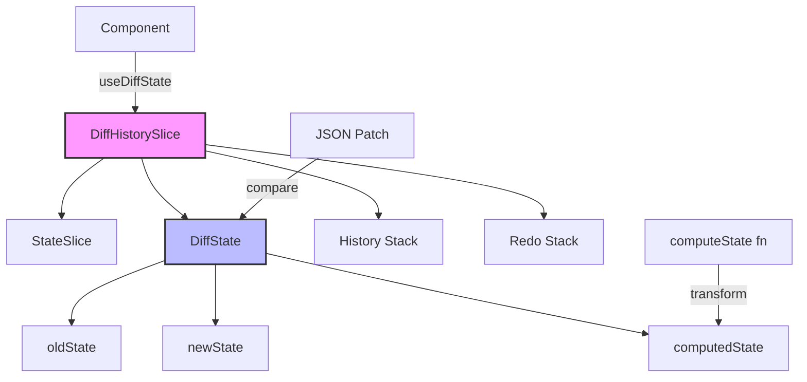
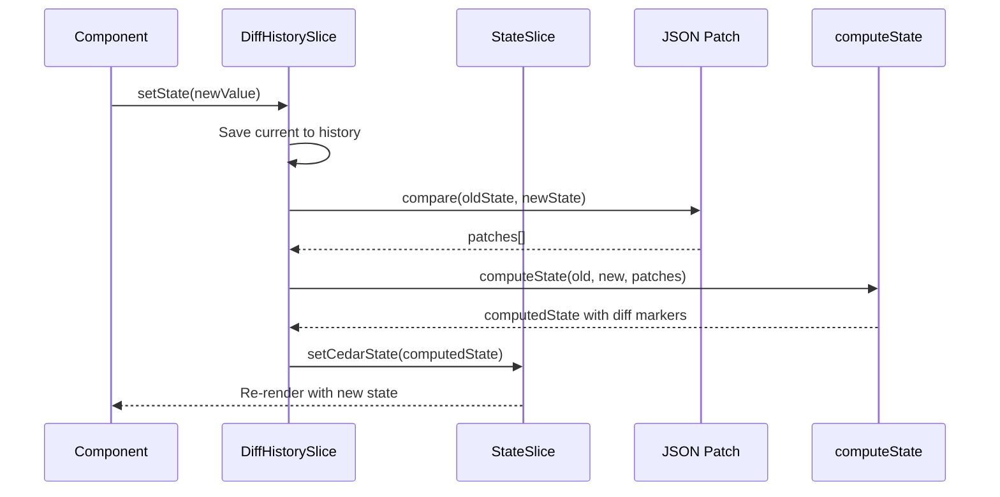

# State Diff Internals

This page provides a technical deep-dive into how Cedar OS's State Diff management system works under the hood. Understanding these internals will help you build more sophisticated diff-tracking features and debug complex scenarios.

## Architecture Overview

The State Diff system is built on top of Zustand and uses JSON Patch (RFC 6902) for efficient change tracking. Here's the high-level architecture:



## Core Components

### DiffHistorySlice

The `DiffHistorySlice` is the main store slice that manages all diff-related state and operations:

```typescript
interface DiffHistorySlice {
  // State storage
  diffHistoryStates: Record<string, DiffHistoryState>;

  // Core operations
  getDiffHistoryState: <T>(key: string) => DiffHistoryState<T> | undefined;
  setDiffState: <T>(key: string, diffHistoryState: DiffHistoryState<T>) => void;
  newDiffState: <T>(key: string, newState: T, isDiffChange?: boolean) => void;

  // Diff management
  acceptAllDiffs: (key: string) => boolean;
  rejectAllDiffs: (key: string) => boolean;
  acceptDiff: <T>(...) => boolean;
  rejectDiff: <T>(...) => boolean;

  // History operations
  undo: (key: string) => boolean;
  redo: (key: string) => boolean;
}
```

### DiffState Structure

Each tracked state maintains a `DiffState` object containing:

```typescript
interface DiffState<T = unknown> {
	oldState: T; // The baseline state
	newState: T; // The proposed new state
	computedState: T; // The transformed state (with diff markers)
	isDiffMode: boolean; // Whether diffs are being tracked
	patches?: Operation[]; // JSON Patch operations describing changes
}
```

### DiffHistoryState

The complete history for each tracked state:

```typescript
interface DiffHistoryState<T = unknown> {
	diffState: DiffState<T>; // Current diff state
	history: DiffState<T>[]; // Previous states for undo
	redoStack: DiffState<T>[]; // Future states for redo
	diffMode: DiffMode; // 'defaultAccept' or 'holdAccept'
	computeState?: ComputeStateFunction<T>; // Transform function
}
```

## Data Flow

### 1. State Registration

When you call `useDiffState` or `registerDiffState`, the following happens:

<Steps>
<Step title="Initialize DiffHistoryState">
```typescript
const initialDiffHistoryState: DiffHistoryState<T> = {
  diffState: {
    oldState: initialValue,
    newState: initialValue,
    computedState: initialValue,
    isDiffMode: false,
    patches: []
  },
  history: [],
  redoStack: [],
  diffMode: options.diffMode || 'defaultAccept',
  computeState: options.computeState
};
```
</Step>

<Step title="Register in StateSlice">
The state is also registered in the `StateSlice` for general state management:

```typescript
store.registerState({
	key,
	value: initialValue,
	setValue,
	description,
	schema,
	stateSetters,
});
```

</Step>

<Step title="Sync Mechanism">
The `setDiffState` method ensures bi-directional sync between DiffHistorySlice and StateSlice:

```typescript
setDiffState: (key, diffHistoryState) => {
	// Update diff history state
	set((state) => ({
		diffHistoryStates: {
			...state.diffHistoryStates,
			[key]: diffHistoryState,
		},
	}));

	// Sync with StateSlice
	const computedValue = diffHistoryState.diffState.computedState;
	if (computedValue !== undefined) {
		store.setCedarState(key, computedValue);
	}
};
```

</Step>
</Steps>

### 2. State Updates

When state changes occur, the system follows this flow:



### 3. Diff Computation

The system uses JSON Patch to efficiently compute differences:

```typescript
function newDiffState(key: string, newState: T, isDiffChange?: boolean) {
	const current = getDiffHistoryState(key);

	// Save current state to history
	const updatedHistory = [...current.history, current.diffState];

	// Determine oldState based on diff mode
	const oldStateForDiff = isDiffChange
		? current.diffState.oldState // Keep original baseline
		: newState; // New baseline

	// Generate patches using fast-json-patch
	const patches = compare(oldStateForDiff, newState);

	// Apply computeState transformation
	const computedState = current.computeState
		? current.computeState(oldStateForDiff, newState, patches)
		: diffMode === 'defaultAccept'
		? newState
		: oldStateForDiff;

	// Create new diff state
	const newDiffState = {
		oldState: oldStateForDiff,
		newState: newState,
		computedState: computedState,
		isDiffMode: isDiffChange,
		patches,
	};
}
```

## ComputeState Function

The `computeState` function is where diff markers are added. Here's how the built-in `addDiffToArrayObjs` works:

```typescript
export function addDiffToArrayObjs<T>(
	oldState: T[],
	newState: T[],
	idField: string = 'id',
	diffPath: string = '',
	diffChecker?: DiffChecker
): T[] {
	const oldMap = new Map(oldState.map((item) => [item[idField], item]));

	return newState.map((item) => {
		const id = item[idField];
		const oldItem = oldMap.get(id);

		if (!oldItem) {
			// Item was added
			return setValueAtPath(item, diffPath, 'added');
		}

		// Check if item changed
		const patches = compare(oldItem, item);
		const filteredPatches = filterPatchesByDiffChecker(patches, diffChecker);

		if (filteredPatches.length > 0) {
			// Item was modified
			return setValueAtPath(item, diffPath, 'changed');
		}

		// No changes
		return item;
	});
}
```

## Accept/Reject Mechanism

### Accepting Changes

When changes are accepted:

<Tabs>
<Tab title="Accept All">
```typescript
acceptAllDiffs(key: string) {
  const current = getDiffHistoryState(key);
  
  // Sync oldState with newState
  const acceptedDiffState = {
    oldState: current.diffState.newState,  // Accept changes
    newState: current.diffState.newState,
    computedState: current.diffState.newState, // No diff markers
    isDiffMode: false,  // Exit diff mode
    patches: []
  };
  
  setDiffState(key, {
    ...current,
    diffState: acceptedDiffState,
    history: [...current.history, current.diffState]
  });
}
```
</Tab>

<Tab title="Accept Individual">
For granular acceptance of specific items:

```typescript
acceptDiff(key, jsonPath, identificationField, targetId) {
  // Get array at path
  const array = getValueAtPath(diffState.newState, jsonPath);

  // Process specific item
  const resultArray = array.map(item => {
    if (getItemIdentifier(item, identificationField) === targetId) {
      // Remove diff markers from accepted item
      return removeDiffMarkers(item);
    }
    return item; // Keep others unchanged
  });

  // Update state with modified array
  const newState = setValueAtPath(diffState.newState, jsonPath, resultArray);

  // Check if any diffs remain
  const stillInDiffMode = hasRemainingDiffs(newState);

  setDiffState(key, {
    ...current,
    diffState: {
      ...diffState,
      newState,
      isDiffMode: stillInDiffMode
    }
  });
}
```

</Tab>
</Tabs>

### Rejecting Changes

When changes are rejected:

```typescript
rejectAllDiffs(key: string) {
  const current = getDiffHistoryState(key);

  // Revert newState to oldState
  const rejectedDiffState = {
    oldState: current.diffState.oldState,
    newState: current.diffState.oldState,  // Revert changes
    computedState: current.diffState.oldState,
    isDiffMode: false,
    patches: []
  };

  setDiffState(key, {
    ...current,
    diffState: rejectedDiffState,
    history: [...current.history, current.diffState]
  });
}
```

## History Management

### Undo Operation

```typescript
undo(key: string) {
  const current = getDiffHistoryState(key);

  if (current.history.length === 0) return false;

  // Pop from history
  const previousState = current.history.pop();

  // Push current to redo stack
  current.redoStack.push(current.diffState);

  // Set previous state as current
  setDiffState(key, {
    ...current,
    diffState: previousState
  });

  return true;
}
```

### Redo Operation

```typescript
redo(key: string) {
  const current = getDiffHistoryState(key);

  if (current.redoStack.length === 0) return false;

  // Pop from redo stack
  const redoState = current.redoStack.pop();

  // Push current to history
  current.history.push(current.diffState);

  // Set redo state as current
  setDiffState(key, {
    ...current,
    diffState: redoState
  });

  return true;
}
```

## Performance Optimizations

### 1. Shallow Subscriptions

The system uses Zustand's shallow equality checks to prevent unnecessary re-renders:

```typescript
const diffData = useCedarStore(useShallow(selector));
```

### 2. JSON Patch Efficiency

Instead of deep-cloning entire states, JSON Patch operations describe minimal changes:

```typescript
// Instead of storing full states:
{ before: entireState1, after: entireState2 }

// We store patches:
[
  { op: "replace", path: "/title", value: "New Title" },
  { op: "add", path: "/items/3", value: newItem }
]
```

### 3. Selective Diff Checking

Use `DiffChecker` to ignore irrelevant changes:

```typescript
const diffChecker: DiffChecker = {
  type: 'ignore',
  fields: ['/metadata/lastModified', '/cache']
};

// These fields won't trigger diff markers
computeState: (old, new) => addDiffToArrayObjs(old, new, 'id', '/data', diffChecker)
```

## Advanced Patterns

### Custom Diff Markers

Create custom computeState functions for specialized diff visualization:

```typescript
function customComputeState(oldState, newState, patches) {
	// Add severity levels to changes
	return newState.map((item, index) => {
		const oldItem = oldState[index];
		if (!oldItem) {
			return { ...item, diffLevel: 'major', diffType: 'added' };
		}

		const itemPatches = patches.filter((p) => p.path.startsWith(`/${index}`));
		if (itemPatches.length > 5) {
			return { ...item, diffLevel: 'major', diffType: 'changed' };
		} else if (itemPatches.length > 0) {
			return { ...item, diffLevel: 'minor', diffType: 'changed' };
		}

		return item;
	});
}
```

### Nested Diff States

Handle complex nested structures:

```typescript
function nestedDiffCompute(oldState, newState) {
	const processNode = (oldNode, newNode, path = '') => {
		if (!oldNode) return { ...newNode, diff: 'added' };
		if (!newNode) return null;

		let hasDiff = false;
		const result = { ...newNode };

		// Check properties
		if (oldNode.value !== newNode.value) {
			result.valueDiff = 'changed';
			hasDiff = true;
		}

		// Process children recursively
		if (newNode.children) {
			result.children = newNode.children.map((child, i) => {
				const oldChild = oldNode.children?.[i];
				const processedChild = processNode(
					oldChild,
					child,
					`${path}/children/${i}`
				);
				if (processedChild?.diff || processedChild?.valueDiff) {
					hasDiff = true;
				}
				return processedChild;
			});
		}

		if (hasDiff) result.diff = 'changed';
		return result;
	};

	return processNode(oldState, newState);
}
```

## Debugging Tips

<Warning>Common issues and how to diagnose them</Warning>

### 1. State Not Updating

Check the data flow:

```typescript
// Add logging to track state changes
const [state, setState] = useDiffState('myState', initial, {
  computeState: (old, new, patches) => {
    console.log('Computing state:', { old, new, patches });
    const result = addDiffToArrayObjs(old, new, 'id');
    console.log('Computed result:', result);
    return result;
  }
});
```

### 2. Diff Markers Not Appearing

Verify the computeState function is being called:

```typescript
const diffState = useCedarStore((s) => s.getDiffHistoryState('myState'));
console.log('Diff state:', {
	isDiffMode: diffState?.diffState.isDiffMode,
	hasComputeState: !!diffState?.computeState,
	computedState: diffState?.diffState.computedState,
});
```

### 3. Memory Leaks

Monitor history stack size:

```typescript
useEffect(() => {
	const interval = setInterval(() => {
		const diffState = store.getDiffHistoryState('myState');
		if (diffState?.history.length > 100) {
			console.warn('Large history stack:', diffState.history.length);
			// Consider implementing history pruning
		}
	}, 5000);

	return () => clearInterval(interval);
}, []);
```

## Integration with AI Systems

The State Diff system is designed to work seamlessly with AI agents:

### State Context for AI

```typescript
// AI agents can access diff information
const stateContext = {
	key: 'nodes',
	oldState: diffState.oldState,
	newState: diffState.newState,
	patches: diffState.patches,
	isDiffMode: diffState.isDiffMode,
};

// Send to AI for intelligent processing
await sendMessage({
	content: 'Review these changes',
	stateContext,
});
```

### AI-Driven Diff Resolution

```typescript
// AI can suggest which diffs to accept/reject
const aiRecommendations = await analyzeChanges(diffState);

aiRecommendations.forEach((rec) => {
	if (rec.action === 'accept') {
		store.acceptDiff(key, rec.path, rec.field, rec.id);
	} else if (rec.action === 'reject') {
		store.rejectDiff(key, rec.path, rec.field, rec.id);
	}
});
```

## Summary

The State Diff system provides a robust foundation for change tracking and management in Cedar OS applications. By understanding these internals, you can:

- Build custom diff visualization strategies
- Optimize performance for large datasets
- Create sophisticated approval workflows
- Integrate deeply with AI systems
- Debug complex state management scenarios

The system's modular design allows for extension while maintaining consistency across your application's state management needs.
