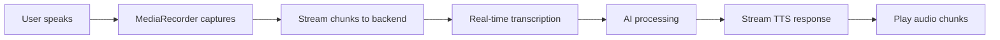

Cedar's voice system supports real-time audio streaming for low-latency voice interactions. This page covers how to implement streaming on both the frontend and backend for optimal voice experience.

## Audio Streaming Flow



## Frontend Streaming

### Real-time Audio Capture

The voice system can stream audio chunks as they're recorded:

```typescript
import { useCedarStore } from '@cedar/core';

function StreamingVoiceChat() {
	const voice = useCedarStore((state) => state.voice);

	const startStreamingCapture = async () => {
		if (!voice.audioStream) {
			await voice.requestVoicePermission();
		}

		const mediaRecorder = new MediaRecorder(voice.audioStream, {
			mimeType: 'audio/webm;codecs=opus',
		});

		// Stream audio chunks every 100ms
		mediaRecorder.start(100);

		mediaRecorder.ondataavailable = async (event) => {
			if (event.data.size > 0) {
				await streamAudioChunk(event.data);
			}
		};
	};

	const streamAudioChunk = async (audioChunk: Blob) => {
		const formData = new FormData();
		formData.append('audioChunk', audioChunk);
		formData.append('settings', JSON.stringify(voice.voiceSettings));
		formData.append('isComplete', 'false');

		try {
			const response = await fetch(`${voice.voiceEndpoint}/stream`, {
				method: 'POST',
				body: formData,
			});

			if (response.ok) {
				const data = await response.json();
				if (data.partialTranscription) {
					// Show real-time transcription
					setPartialTranscription(data.partialTranscription);
				}
			}
		} catch (error) {
			console.error('Streaming error:', error);
		}
	};

	return (
		<div>
			<button onClick={startStreamingCapture}>Start Streaming</button>
			{partialTranscription && (
				<div className='partial-transcription'>{partialTranscription}</div>
			)}
		</div>
	);
}
```

### Server-Sent Events (SSE) for Responses

Handle streaming responses from the backend:

```typescript
const handleStreamingResponse = async () => {
	const eventSource = new EventSource(
		`${voice.voiceEndpoint}/stream-response?sessionId=${sessionId}`
	);

	eventSource.onmessage = (event) => {
		const data = JSON.parse(event.data);

		switch (data.type) {
			case 'transcription':
				// Update transcription in real-time
				setTranscription(data.text);
				break;

			case 'response_start':
				// AI started generating response
				setIsProcessing(true);
				break;

			case 'response_chunk':
				// Partial response text
				setPartialResponse((prev) => prev + data.text);
				break;

			case 'audio_chunk':
				// Play audio chunk immediately
				playAudioChunk(data.audioData);
				break;

			case 'complete':
				// Conversation turn complete
				setIsProcessing(false);
				eventSource.close();
				break;
		}
	};

	eventSource.onerror = (error) => {
		console.error('SSE error:', error);
		eventSource.close();
	};
};

const playAudioChunk = async (base64Audio: string) => {
	const audioData = atob(base64Audio);
	const audioArray = new Uint8Array(audioData.length);

	for (let i = 0; i < audioData.length; i++) {
		audioArray[i] = audioData.charCodeAt(i);
	}

	const audioBlob = new Blob([audioArray], { type: 'audio/mpeg' });
	const audioUrl = URL.createObjectURL(audioBlob);

	const audio = new Audio(audioUrl);
	await audio.play();

	// Clean up
	audio.onended = () => URL.revokeObjectURL(audioUrl);
};
```

## Backend Streaming Implementation

### Node.js Streaming Server

```typescript
import express from 'express';
import multer from 'multer';
import { WebSocketServer } from 'ws';
import OpenAI from 'openai';

const app = express();
const upload = multer();
const openai = new OpenAI();

// Session management for streaming
const activeSessions = new Map();

// WebSocket for real-time streaming
const wss = new WebSocketServer({ port: 8080 });

wss.on('connection', (ws, req) => {
	const sessionId = new URL(req.url, 'http://localhost').searchParams.get(
		'sessionId'
	);

	if (sessionId) {
		activeSessions.set(sessionId, { ws, buffer: [] });
	}

	ws.on('message', async (message) => {
		const data = JSON.parse(message.toString());

		if (data.type === 'audio_chunk') {
			await handleAudioChunk(sessionId, data.audioData);
		}
	});

	ws.on('close', () => {
		activeSessions.delete(sessionId);
	});
});

// HTTP endpoint for audio chunk streaming
app.post(
	'/api/chat/voice/stream',
	upload.single('audioChunk'),
	async (req, res) => {
		const { sessionId, isComplete } = req.body;
		const audioChunk = req.file;

		if (!sessionId) {
			return res.status(400).json({ error: 'Session ID required' });
		}

		const session = activeSessions.get(sessionId) || { buffer: [] };

		if (audioChunk) {
			session.buffer.push(audioChunk.buffer);
		}

		// Process accumulated audio for partial transcription
		if (session.buffer.length > 0) {
			const combinedAudio = Buffer.concat(session.buffer);

			try {
				// Use OpenAI Whisper for real-time transcription
				const transcription = await openai.audio.transcriptions.create({
					file: new File([combinedAudio], 'chunk.webm', { type: 'audio/webm' }),
					model: 'whisper-1',
					response_format: 'verbose_json',
				});

				// Send partial transcription
				if (session.ws) {
					session.ws.send(
						JSON.stringify({
							type: 'transcription',
							text: transcription.text,
							isPartial: !isComplete,
						})
					);
				}

				res.json({
					partialTranscription: transcription.text,
					confidence: transcription.segments?.[0]?.no_speech_prob,
				});
			} catch (error) {
				console.error('Transcription error:', error);
				res.status(500).json({ error: 'Transcription failed' });
			}
		}

		// Process complete audio
		if (isComplete === 'true') {
			await processCompleteAudio(sessionId, session);
		}
	}
);

async function processCompleteAudio(sessionId: string, session: any) {
	const combinedAudio = Buffer.concat(session.buffer);

	try {
		// Final transcription
		const transcription = await openai.audio.transcriptions.create({
			file: new File([combinedAudio], 'complete.webm', { type: 'audio/webm' }),
			model: 'whisper-1',
		});

		// Generate streaming response
		const stream = await openai.chat.completions.create({
			model: 'gpt-4',
			messages: [{ role: 'user', content: transcription.text }],
			stream: true,
		});

		let fullResponse = '';

		// Send response start
		session.ws?.send(
			JSON.stringify({
				type: 'response_start',
				transcription: transcription.text,
			})
		);

		// Stream response chunks
		for await (const chunk of stream) {
			const content = chunk.choices[0]?.delta?.content || '';
			if (content) {
				fullResponse += content;

				session.ws?.send(
					JSON.stringify({
						type: 'response_chunk',
						text: content,
					})
				);
			}
		}

		// Generate and stream audio response
		await streamTTSResponse(sessionId, fullResponse, session);
	} catch (error) {
		console.error('Processing error:', error);
		session.ws?.send(
			JSON.stringify({
				type: 'error',
				message: 'Failed to process audio',
			})
		);
	}
}

async function streamTTSResponse(
	sessionId: string,
	text: string,
	session: any
) {
	try {
		// Generate speech
		const speech = await openai.audio.speech.create({
			model: 'tts-1',
			voice: 'alloy',
			input: text,
			response_format: 'mp3',
		});

		const audioBuffer = Buffer.from(await speech.arrayBuffer());

		// Split audio into chunks for streaming
		const chunkSize = 4096; // 4KB chunks

		for (let i = 0; i < audioBuffer.length; i += chunkSize) {
			const chunk = audioBuffer.slice(i, i + chunkSize);
			const base64Chunk = chunk.toString('base64');

			session.ws?.send(
				JSON.stringify({
					type: 'audio_chunk',
					audioData: base64Chunk,
					isLast: i + chunkSize >= audioBuffer.length,
				})
			);

			// Small delay to prevent overwhelming the client
			await new Promise((resolve) => setTimeout(resolve, 50));
		}

		// Mark completion
		session.ws?.send(
			JSON.stringify({
				type: 'complete',
				transcription: session.finalTranscription,
				response: text,
			})
		);
	} catch (error) {
		console.error('TTS streaming error:', error);
		session.ws?.send(
			JSON.stringify({
				type: 'error',
				message: 'Failed to generate speech',
			})
		);
	}
}
```

### Server-Sent Events Implementation

Alternative to WebSockets using SSE:

```typescript
// SSE endpoint for streaming responses
app.get('/api/chat/voice/stream-response', (req, res) => {
	const { sessionId } = req.query;

	// Set SSE headers
	res.writeHead(200, {
		'Content-Type': 'text/event-stream',
		'Cache-Control': 'no-cache',
		Connection: 'keep-alive',
		'Access-Control-Allow-Origin': '*',
	});

	// Store connection for this session
	const session = activeSessions.get(sessionId);
	if (session) {
		session.sseResponse = res;
	}

	// Keep connection alive
	const keepAlive = setInterval(() => {
		res.write('data: {"type":"ping"}\n\n');
	}, 30000);

	req.on('close', () => {
		clearInterval(keepAlive);
		if (session) {
			session.sseResponse = null;
		}
	});
});

// Helper function to send SSE data
function sendSSE(sessionId: string, data: any) {
	const session = activeSessions.get(sessionId);
	if (session?.sseResponse) {
		session.sseResponse.write(`data: ${JSON.stringify(data)}\n\n`);
	}
}
```

## Performance Optimization

### Audio Buffer Management

```typescript
class AudioStreamBuffer {
	private chunks: Blob[] = [];
	private maxBufferSize = 10; // Maximum chunks to buffer

	addChunk(chunk: Blob) {
		this.chunks.push(chunk);

		// Remove old chunks if buffer is full
		if (this.chunks.length > this.maxBufferSize) {
			this.chunks.shift();
		}
	}

	getCombinedAudio(): Blob {
		return new Blob(this.chunks, { type: 'audio/webm' });
	}

	clear() {
		this.chunks = [];
	}
}
```

### Adaptive Quality

Adjust audio quality based on network conditions:

```typescript
const adaptiveRecorder = (stream: MediaStream) => {
	let currentQuality = 'high';

	const getRecorderOptions = () => {
		switch (currentQuality) {
			case 'high':
				return {
					mimeType: 'audio/webm;codecs=opus',
					audioBitsPerSecond: 128000,
				};
			case 'medium':
				return {
					mimeType: 'audio/webm;codecs=opus',
					audioBitsPerSecond: 64000,
				};
			case 'low':
				return {
					mimeType: 'audio/webm;codecs=opus',
					audioBitsPerSecond: 32000,
				};
		}
	};

	// Monitor network conditions
	const connection = (navigator as any).connection;
	if (connection) {
		connection.addEventListener('change', () => {
			if (connection.effectiveType === '4g') {
				currentQuality = 'high';
			} else if (connection.effectiveType === '3g') {
				currentQuality = 'medium';
			} else {
				currentQuality = 'low';
			}
		});
	}

	return new MediaRecorder(stream, getRecorderOptions());
};
```

## Error Handling and Resilience

### Connection Recovery

```typescript
class StreamingVoiceClient {
	private reconnectAttempts = 0;
	private maxReconnectAttempts = 3;
	private reconnectDelay = 1000;

	async connectWithRetry(sessionId: string) {
		try {
			await this.connect(sessionId);
			this.reconnectAttempts = 0;
		} catch (error) {
			console.error('Connection failed:', error);

			if (this.reconnectAttempts < this.maxReconnectAttempts) {
				this.reconnectAttempts++;
				const delay =
					this.reconnectDelay * Math.pow(2, this.reconnectAttempts - 1);

				setTimeout(() => {
					this.connectWithRetry(sessionId);
				}, delay);
			} else {
				throw new Error('Max reconnection attempts reached');
			}
		}
	}

	private async connect(sessionId: string) {
		// WebSocket connection logic
		const ws = new WebSocket(`ws://localhost:8080?sessionId=${sessionId}`);

		ws.onopen = () => {
			console.log('Connected to streaming server');
		};

		ws.onerror = (error) => {
			throw error;
		};

		return ws;
	}
}
```

## Testing Streaming Implementation

### Load Testing

```typescript
// Test multiple concurrent streaming sessions
async function loadTestStreaming() {
	const sessions = [];
	const numSessions = 10;

	for (let i = 0; i < numSessions; i++) {
		const sessionId = `test-session-${i}`;
		sessions.push(testStreamingSession(sessionId));
	}

	const results = await Promise.allSettled(sessions);

	results.forEach((result, index) => {
		if (result.status === 'fulfilled') {
			console.log(`Session ${index} completed successfully`);
		} else {
			console.error(`Session ${index} failed:`, result.reason);
		}
	});
}

async function testStreamingSession(sessionId: string) {
	// Simulate audio streaming
	const chunks = generateTestAudioChunks();

	for (const chunk of chunks) {
		await streamAudioChunk(sessionId, chunk);
		await new Promise((resolve) => setTimeout(resolve, 100));
	}
}
```

### Latency Measurement

```typescript
class LatencyTracker {
	private timestamps = new Map();

	markStart(eventId: string) {
		this.timestamps.set(eventId, performance.now());
	}

	markEnd(eventId: string): number {
		const startTime = this.timestamps.get(eventId);
		if (!startTime) return -1;

		const latency = performance.now() - startTime;
		this.timestamps.delete(eventId);
		return latency;
	}
}

// Usage in voice streaming
const latencyTracker = new LatencyTracker();

// Measure speech-to-text latency
latencyTracker.markStart('transcription');
const transcription = await transcribeAudio(audioChunk);
const transcriptionLatency = latencyTracker.markEnd('transcription');

// Measure end-to-end latency
latencyTracker.markStart('end-to-end');
// ... full voice interaction
const totalLatency = latencyTracker.markEnd('end-to-end');
```

## Best Practices

1. **Buffer Management**: Keep audio buffers small to minimize latency
2. **Error Recovery**: Implement robust reconnection logic
3. **Quality Adaptation**: Adjust audio quality based on network conditions
4. **Resource Cleanup**: Always clean up WebSocket connections and audio resources
5. **Monitoring**: Track latency and error rates for performance optimization

## Next Steps

<CardGroup cols={2}>
	<Card title='WebSocket Implementation' icon='plug' href='/voice/websockets'>
		Learn about WebSocket-based real-time voice communication
	</Card>
	<Card
		title='Voice Overview'
		icon='microphone'
		href='/voice/voice-integration'>
		Return to the main voice documentation
	</Card>
</CardGroup>
