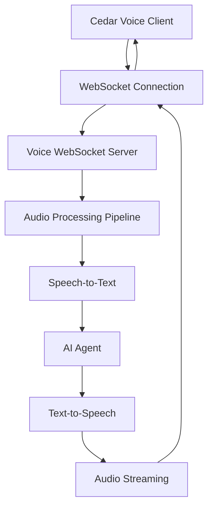

WebSockets provide the most efficient way to implement real-time voice communication in Cedar. This approach enables bidirectional streaming with minimal latency for natural conversation flows.

## Architecture Overview



## Frontend WebSocket Integration

### Enhanced Voice Slice with WebSocket Support

```typescript
import { StateCreator } from 'zustand';

interface WebSocketVoiceState extends VoiceState {
	websocket: WebSocket | null;
	connectionStatus: 'disconnected' | 'connecting' | 'connected' | 'error';
	sessionId: string | null;
}

interface WebSocketVoiceActions extends VoiceActions {
	connectWebSocket: () => Promise<void>;
	disconnectWebSocket: () => void;
	sendAudioChunk: (audioData: Blob) => void;
}

export const createWebSocketVoiceSlice: StateCreator<
	CedarStore,
	[],
	[],
	WebSocketVoiceState & WebSocketVoiceActions
> = (set, get) => ({
	...initialVoiceState,
	websocket: null,
	connectionStatus: 'disconnected',
	sessionId: null,

	connectWebSocket: async () => {
		const { voiceEndpoint } = get();
		const sessionId = crypto.randomUUID();

		set({ connectionStatus: 'connecting', sessionId });

		try {
			const wsUrl =
				voiceEndpoint.replace('http', 'ws') + `/ws?sessionId=${sessionId}`;
			const websocket = new WebSocket(wsUrl);

			websocket.onopen = () => {
				console.log('WebSocket connected');
				set({ connectionStatus: 'connected' });

				// Send initial configuration
				websocket.send(
					JSON.stringify({
						type: 'config',
						settings: get().voiceSettings,
						context: get().compileAdditionalContext(),
					})
				);
			};

			websocket.onmessage = (event) => {
				const data = JSON.parse(event.data);
				get().handleWebSocketMessage(data);
			};

			websocket.onerror = (error) => {
				console.error('WebSocket error:', error);
				set({
					connectionStatus: 'error',
					voiceError: 'WebSocket connection failed',
				});
			};

			websocket.onclose = () => {
				console.log('WebSocket disconnected');
				set({ connectionStatus: 'disconnected', websocket: null });
			};

			set({ websocket });
		} catch (error) {
			set({
				connectionStatus: 'error',
				voiceError:
					error instanceof Error ? error.message : 'Connection failed',
			});
		}
	},

	disconnectWebSocket: () => {
		const { websocket } = get();
		if (websocket) {
			websocket.close();
			set({ websocket: null, connectionStatus: 'disconnected' });
		}
	},

	sendAudioChunk: (audioData: Blob) => {
		const { websocket, connectionStatus } = get();

		if (connectionStatus !== 'connected' || !websocket) {
			console.warn('WebSocket not connected');
			return;
		}

		// Convert blob to base64 for transmission
		const reader = new FileReader();
		reader.onload = () => {
			const base64Data = (reader.result as string).split(',')[1];
			websocket.send(
				JSON.stringify({
					type: 'audio_chunk',
					data: base64Data,
					timestamp: Date.now(),
				})
			);
		};
		reader.readAsDataURL(audioData);
	},

	handleWebSocketMessage: (message: any) => {
		const { addMessage, playAudioResponse, voiceSettings } = get();

		switch (message.type) {
			case 'transcription_partial':
				// Handle real-time transcription updates
				set({ partialTranscription: message.text });
				break;

			case 'transcription_final':
				// Add user message to chat
				if (voiceSettings.autoAddToMessages) {
					addMessage({
						type: 'text',
						role: 'user',
						content: message.text,
						metadata: {
							source: 'voice',
							timestamp: new Date().toISOString(),
						},
					});
				}
				break;

			case 'response_start':
				set({ isSpeaking: true, partialResponse: '' });
				break;

			case 'response_chunk':
				set((state) => ({
					partialResponse: (state.partialResponse || '') + message.text,
				}));
				break;

			case 'response_complete':
				// Add assistant message to chat
				if (voiceSettings.autoAddToMessages) {
					addMessage({
						type: 'text',
						role: 'assistant',
						content: message.text,
						metadata: {
							source: 'voice',
							usage: message.usage,
							timestamp: new Date().toISOString(),
						},
					});
				}
				break;

			case 'audio_chunk':
				// Play audio chunk immediately
				get().playAudioChunk(message.data);
				break;

			case 'audio_complete':
				set({ isSpeaking: false });
				break;

			case 'setState':
				// Handle structured actions
				if (message.stateKey && message.setterKey) {
					const { executeStateSetter } = get();
					executeStateSetter(message.stateKey, message.setterKey, message.args);
				}
				break;

			case 'error':
				set({ voiceError: message.message });
				break;
		}
	},

	playAudioChunk: async (base64Data: string) => {
		try {
			const audioData = atob(base64Data);
			const audioArray = new Uint8Array(audioData.length);

			for (let i = 0; i < audioData.length; i++) {
				audioArray[i] = audioData.charCodeAt(i);
			}

			const audioBlob = new Blob([audioArray], { type: 'audio/mpeg' });
			const audioUrl = URL.createObjectURL(audioBlob);

			const audio = new Audio(audioUrl);
			await audio.play();

			audio.onended = () => URL.revokeObjectURL(audioUrl);
		} catch (error) {
			console.error('Error playing audio chunk:', error);
		}
	},

	// Override the original startListening to use WebSocket
	startListening: async () => {
		const state = get();

		if (state.connectionStatus !== 'connected') {
			await get().connectWebSocket();
		}

		if (state.voicePermissionStatus !== 'granted') {
			await get().requestVoicePermission();
		}

		if (!state.audioStream) {
			set({ voiceError: 'No audio stream available' });
			return;
		}

		try {
			const mediaRecorder = new MediaRecorder(state.audioStream, {
				mimeType: 'audio/webm;codecs=opus',
			});

			// Stream audio chunks in real-time
			mediaRecorder.ondataavailable = (event) => {
				if (event.data.size > 0) {
					get().sendAudioChunk(event.data);
				}
			};

			// Start recording with small timeslices for real-time streaming
			mediaRecorder.start(100); // 100ms chunks

			set({
				mediaRecorder,
				isListening: true,
				voiceError: null,
			});
		} catch (error) {
			set({
				voiceError:
					error instanceof Error ? error.message : 'Failed to start recording',
			});
		}
	},
});
```

### WebSocket Voice Component

```typescript
import { useCedarStore } from '@cedar/core';
import { VoiceIndicator } from '@cedar/voice';
import { useEffect, useState } from 'react';

export function WebSocketVoiceChat() {
	const voice = useCedarStore((state) => state.voice);
	const [partialTranscription, setPartialTranscription] = useState('');
	const [partialResponse, setPartialResponse] = useState('');

	useEffect(() => {
		// Set WebSocket endpoint
		voice.setVoiceEndpoint('ws://localhost:8080/api/voice');

		// Cleanup on unmount
		return () => {
			voice.disconnectWebSocket();
			voice.resetVoiceState();
		};
	}, []);

	const handleVoiceToggle = async () => {
		if (voice.isListening) {
			voice.stopListening();
		} else {
			await voice.startListening();
		}
	};

	const connectionStatusColor = {
		disconnected: 'text-gray-500',
		connecting: 'text-yellow-500',
		connected: 'text-green-500',
		error: 'text-red-500',
	};

	return (
		<div className='voice-chat-container'>
			{/* Connection Status */}
			<div
				className={`connection-status ${
					connectionStatusColor[voice.connectionStatus]
				}`}>
				Status: {voice.connectionStatus}
			</div>

			{/* Voice Indicator */}
			<VoiceIndicator voiceState={voice} />

			{/* Voice Controls */}
			<div className='voice-controls'>
				<button
					onClick={handleVoiceToggle}
					disabled={voice.connectionStatus !== 'connected'}
					className={`voice-button ${voice.isListening ? 'listening' : ''}`}>
					{voice.isListening ? 'Stop Listening' : 'Start Listening'}
				</button>

				<button
					onClick={() => voice.connectWebSocket()}
					disabled={voice.connectionStatus === 'connecting'}>
					{voice.connectionStatus === 'connected' ? 'Reconnect' : 'Connect'}
				</button>
			</div>

			{/* Real-time Transcription */}
			{partialTranscription && (
				<div className='partial-transcription'>
					<h4>You're saying:</h4>
					<p>{partialTranscription}</p>
				</div>
			)}

			{/* Real-time Response */}
			{partialResponse && (
				<div className='partial-response'>
					<h4>AI is responding:</h4>
					<p>{partialResponse}</p>
				</div>
			)}

			{/* Error Display */}
			{voice.voiceError && (
				<div className='error-message'>{voice.voiceError}</div>
			)}

			{/* Voice Settings */}
			<div className='voice-settings'>
				<label>
					Language:
					<select
						value={voice.voiceSettings.language}
						onChange={(e) =>
							voice.updateVoiceSettings({ language: e.target.value })
						}>
						<option value='en-US'>English (US)</option>
						<option value='en-GB'>English (UK)</option>
						<option value='es-ES'>Spanish</option>
						<option value='fr-FR'>French</option>
					</select>
				</label>

				<label>
					Voice:
					<select
						value={voice.voiceSettings.voiceId || 'alloy'}
						onChange={(e) =>
							voice.updateVoiceSettings({ voiceId: e.target.value })
						}>
						<option value='alloy'>Alloy</option>
						<option value='echo'>Echo</option>
						<option value='fable'>Fable</option>
						<option value='onyx'>Onyx</option>
						<option value='nova'>Nova</option>
						<option value='shimmer'>Shimmer</option>
					</select>
				</label>
			</div>
		</div>
	);
}
```

## Backend WebSocket Server

### Node.js WebSocket Server

```typescript
import express from 'express';
import { WebSocketServer, WebSocket } from 'ws';
import { createServer } from 'http';
import OpenAI from 'openai';
import { v4 as uuidv4 } from 'uuid';

const app = express();
const server = createServer(app);
const wss = new WebSocketServer({ server });

const openai = new OpenAI();

interface VoiceSession {
	id: string;
	ws: WebSocket;
	audioBuffer: Buffer[];
	isProcessing: boolean;
	settings: any;
	context: any;
}

const activeSessions = new Map<string, VoiceSession>();

wss.on('connection', (ws, req) => {
	const url = new URL(req.url!, 'http://localhost');
	const sessionId = url.searchParams.get('sessionId') || uuidv4();

	console.log(`New WebSocket connection: ${sessionId}`);

	const session: VoiceSession = {
		id: sessionId,
		ws,
		audioBuffer: [],
		isProcessing: false,
		settings: {},
		context: {},
	};

	activeSessions.set(sessionId, session);

	ws.on('message', async (message) => {
		try {
			const data = JSON.parse(message.toString());
			await handleWebSocketMessage(session, data);
		} catch (error) {
			console.error('Error handling WebSocket message:', error);
			ws.send(
				JSON.stringify({
					type: 'error',
					message: 'Failed to process message',
				})
			);
		}
	});

	ws.on('close', () => {
		console.log(`WebSocket disconnected: ${sessionId}`);
		activeSessions.delete(sessionId);
	});

	ws.on('error', (error) => {
		console.error(`WebSocket error for ${sessionId}:`, error);
		activeSessions.delete(sessionId);
	});

	// Send connection confirmation
	ws.send(
		JSON.stringify({
			type: 'connected',
			sessionId,
		})
	);
});

async function handleWebSocketMessage(session: VoiceSession, data: any) {
	switch (data.type) {
		case 'config':
			session.settings = data.settings;
			session.context = data.context;
			break;

		case 'audio_chunk':
			await handleAudioChunk(session, data);
			break;

		case 'start_listening':
			session.audioBuffer = [];
			session.isProcessing = false;
			break;

		case 'stop_listening':
			await processCompleteAudio(session);
			break;

		default:
			console.warn(`Unknown message type: ${data.type}`);
	}
}

async function handleAudioChunk(session: VoiceSession, data: any) {
	// Convert base64 to buffer
	const audioChunk = Buffer.from(data.data, 'base64');
	session.audioBuffer.push(audioChunk);

	// Process partial transcription for real-time feedback
	if (session.audioBuffer.length % 5 === 0) {
		// Every 5 chunks
		await processPartialAudio(session);
	}
}

async function processPartialAudio(session: VoiceSession) {
	if (session.isProcessing) return;

	try {
		const combinedAudio = Buffer.concat(session.audioBuffer);

		// Use OpenAI Whisper for partial transcription
		const transcription = await openai.audio.transcriptions.create({
			file: new File([combinedAudio], 'partial.webm', { type: 'audio/webm' }),
			model: 'whisper-1',
			language: session.settings.language?.split('-')[0] || 'en',
		});

		// Send partial transcription
		session.ws.send(
			JSON.stringify({
				type: 'transcription_partial',
				text: transcription.text,
				confidence: 0.8, // Placeholder confidence
			})
		);
	} catch (error) {
		console.error('Partial transcription error:', error);
	}
}

async function processCompleteAudio(session: VoiceSession) {
	if (session.audioBuffer.length === 0) return;

	session.isProcessing = true;

	try {
		const combinedAudio = Buffer.concat(session.audioBuffer);

		// Final transcription
		const transcription = await openai.audio.transcriptions.create({
			file: new File([combinedAudio], 'complete.webm', { type: 'audio/webm' }),
			model: 'whisper-1',
			language: session.settings.language?.split('-')[0] || 'en',
		});

		// Send final transcription
		session.ws.send(
			JSON.stringify({
				type: 'transcription_final',
				text: transcription.text,
			})
		);

		// Generate AI response with streaming
		await generateStreamingResponse(session, transcription.text);
	} catch (error) {
		console.error('Audio processing error:', error);
		session.ws.send(
			JSON.stringify({
				type: 'error',
				message: 'Failed to process audio',
			})
		);
	} finally {
		session.isProcessing = false;
		session.audioBuffer = [];
	}
}

async function generateStreamingResponse(
	session: VoiceSession,
	userInput: string
) {
	try {
		// Send response start
		session.ws.send(
			JSON.stringify({
				type: 'response_start',
			})
		);

		// Create messages with context
		const messages = [
			{
				role: 'system',
				content: `Context: ${JSON.stringify(session.context)}`,
			},
			{ role: 'user', content: userInput },
		];

		// Stream AI response
		const stream = await openai.chat.completions.create({
			model: 'gpt-4',
			messages: messages as any,
			stream: true,
		});

		let fullResponse = '';

		for await (const chunk of stream) {
			const content = chunk.choices[0]?.delta?.content || '';
			if (content) {
				fullResponse += content;

				// Send response chunk
				session.ws.send(
					JSON.stringify({
						type: 'response_chunk',
						text: content,
					})
				);
			}
		}

		// Send complete response
		session.ws.send(
			JSON.stringify({
				type: 'response_complete',
				text: fullResponse,
			})
		);

		// Generate and stream audio response
		await generateStreamingAudio(session, fullResponse);
	} catch (error) {
		console.error('Response generation error:', error);
		session.ws.send(
			JSON.stringify({
				type: 'error',
				message: 'Failed to generate response',
			})
		);
	}
}

async function generateStreamingAudio(session: VoiceSession, text: string) {
	try {
		// Generate speech
		const speech = await openai.audio.speech.create({
			model: 'tts-1',
			voice: session.settings.voiceId || 'alloy',
			input: text,
			response_format: 'mp3',
			speed: session.settings.rate || 1.0,
		});

		const audioBuffer = Buffer.from(await speech.arrayBuffer());

		// Stream audio in chunks
		const chunkSize = 4096;

		for (let i = 0; i < audioBuffer.length; i += chunkSize) {
			const chunk = audioBuffer.slice(i, i + chunkSize);
			const base64Chunk = chunk.toString('base64');

			session.ws.send(
				JSON.stringify({
					type: 'audio_chunk',
					data: base64Chunk,
					isLast: i + chunkSize >= audioBuffer.length,
				})
			);

			// Small delay to prevent overwhelming the client
			await new Promise((resolve) => setTimeout(resolve, 30));
		}

		// Mark audio complete
		session.ws.send(
			JSON.stringify({
				type: 'audio_complete',
			})
		);
	} catch (error) {
		console.error('TTS generation error:', error);
		session.ws.send(
			JSON.stringify({
				type: 'error',
				message: 'Failed to generate speech',
			})
		);
	}
}

// Start server
const PORT = process.env.PORT || 8080;
server.listen(PORT, () => {
	console.log(`WebSocket voice server running on port ${PORT}`);
});
```

### Python WebSocket Server (FastAPI + WebSockets)

```python
from fastapi import FastAPI, WebSocket, WebSocketDisconnect
from fastapi.websockets import WebSocketState
import json
import asyncio
import openai
import base64
import uuid
from typing import Dict, List
import logging

app = FastAPI()

class VoiceSession:
    def __init__(self, session_id: str, websocket: WebSocket):
        self.session_id = session_id
        self.websocket = websocket
        self.audio_buffer: List[bytes] = []
        self.is_processing = False
        self.settings = {}
        self.context = {}

active_sessions: Dict[str, VoiceSession] = {}

@app.websocket("/api/voice/ws")
async def websocket_endpoint(websocket: WebSocket):
    await websocket.accept()

    session_id = str(uuid.uuid4())
    session = VoiceSession(session_id, websocket)
    active_sessions[session_id] = session

    try:
        # Send connection confirmation
        await websocket.send_json({
            "type": "connected",
            "sessionId": session_id
        })

        while True:
            data = await websocket.receive_json()
            await handle_websocket_message(session, data)

    except WebSocketDisconnect:
        logging.info(f"WebSocket disconnected: {session_id}")
    except Exception as e:
        logging.error(f"WebSocket error for {session_id}: {e}")
    finally:
        if session_id in active_sessions:
            del active_sessions[session_id]

async def handle_websocket_message(session: VoiceSession, data: dict):
    message_type = data.get("type")

    if message_type == "config":
        session.settings = data.get("settings", {})
        session.context = data.get("context", {})

    elif message_type == "audio_chunk":
        await handle_audio_chunk(session, data)

    elif message_type == "start_listening":
        session.audio_buffer = []
        session.is_processing = False

    elif message_type == "stop_listening":
        await process_complete_audio(session)

    else:
        logging.warning(f"Unknown message type: {message_type}")

async def handle_audio_chunk(session: VoiceSession, data: dict):
    # Convert base64 to bytes
    audio_chunk = base64.b64decode(data["data"])
    session.audio_buffer.append(audio_chunk)

    # Process partial transcription every 5 chunks
    if len(session.audio_buffer) % 5 == 0:
        await process_partial_audio(session)

async def process_partial_audio(session: VoiceSession):
    if session.is_processing:
        return

    try:
        combined_audio = b''.join(session.audio_buffer)

        # Use OpenAI Whisper for partial transcription
        transcription = await openai.Audio.atranscribe(
            model="whisper-1",
            file=combined_audio,
            language=session.settings.get("language", "en")[:2]
        )

        # Send partial transcription
        await session.websocket.send_json({
            "type": "transcription_partial",
            "text": transcription["text"],
            "confidence": 0.8
        })

    except Exception as e:
        logging.error(f"Partial transcription error: {e}")

async def process_complete_audio(session: VoiceSession):
    if not session.audio_buffer:
        return

    session.is_processing = True

    try:
        combined_audio = b''.join(session.audio_buffer)

        # Final transcription
        transcription = await openai.Audio.atranscribe(
            model="whisper-1",
            file=combined_audio,
            language=session.settings.get("language", "en")[:2]
        )

        # Send final transcription
        await session.websocket.send_json({
            "type": "transcription_final",
            "text": transcription["text"]
        })

        # Generate streaming response
        await generate_streaming_response(session, transcription["text"])

    except Exception as e:
        logging.error(f"Audio processing error: {e}")
        await session.websocket.send_json({
            "type": "error",
            "message": "Failed to process audio"
        })
    finally:
        session.is_processing = False
        session.audio_buffer = []

async def generate_streaming_response(session: VoiceSession, user_input: str):
    try:
        # Send response start
        await session.websocket.send_json({
            "type": "response_start"
        })

        # Create messages with context
        messages = [
            {"role": "system", "content": f"Context: {json.dumps(session.context)}"},
            {"role": "user", "content": user_input}
        ]

        # Stream AI response
        full_response = ""
        async for chunk in await openai.ChatCompletion.acreate(
            model="gpt-4",
            messages=messages,
            stream=True
        ):
            content = chunk.choices[0].delta.get("content", "")
            if content:
                full_response += content

                # Send response chunk
                await session.websocket.send_json({
                    "type": "response_chunk",
                    "text": content
                })

        # Send complete response
        await session.websocket.send_json({
            "type": "response_complete",
            "text": full_response
        })

        # Generate and stream audio response
        await generate_streaming_audio(session, full_response)

    except Exception as e:
        logging.error(f"Response generation error: {e}")
        await session.websocket.send_json({
            "type": "error",
            "message": "Failed to generate response"
        })

async def generate_streaming_audio(session: VoiceSession, text: str):
    try:
        # Generate speech
        speech_response = await openai.Audio.aspeech.create(
            model="tts-1",
            voice=session.settings.get("voiceId", "alloy"),
            input=text,
            response_format="mp3",
            speed=session.settings.get("rate", 1.0)
        )

        audio_data = speech_response.content

        # Stream audio in chunks
        chunk_size = 4096

        for i in range(0, len(audio_data), chunk_size):
            chunk = audio_data[i:i + chunk_size]
            base64_chunk = base64.b64encode(chunk).decode()

            await session.websocket.send_json({
                "type": "audio_chunk",
                "data": base64_chunk,
                "isLast": i + chunk_size >= len(audio_data)
            })

            # Small delay to prevent overwhelming the client
            await asyncio.sleep(0.03)

        # Mark audio complete
        await session.websocket.send_json({
            "type": "audio_complete"
        })

    except Exception as e:
        logging.error(f"TTS generation error: {e}")
        await session.websocket.send_json({
            "type": "error",
            "message": "Failed to generate speech"
        })

if __name__ == "__main__":
    import uvicorn
    uvicorn.run(app, host="0.0.0.0", port=8080)
```

## Advanced Features

### Voice Activity Detection

```typescript
class VoiceActivityDetector {
	private audioContext: AudioContext;
	private analyser: AnalyserNode;
	private dataArray: Uint8Array;
	private threshold: number = 30;
	private silenceTimeout: number = 2000; // 2 seconds
	private silenceTimer: NodeJS.Timeout | null = null;

	constructor(audioStream: MediaStream) {
		this.audioContext = new AudioContext();
		this.analyser = this.audioContext.createAnalyser();

		const source = this.audioContext.createMediaStreamSource(audioStream);
		source.connect(this.analyser);

		this.analyser.fftSize = 256;
		this.dataArray = new Uint8Array(this.analyser.frequencyBinCount);
	}

	startDetection(onSpeechStart: () => void, onSpeechEnd: () => void) {
		const checkAudioLevel = () => {
			this.analyser.getByteFrequencyData(this.dataArray);

			const average =
				this.dataArray.reduce((a, b) => a + b) / this.dataArray.length;

			if (average > this.threshold) {
				// Speech detected
				if (this.silenceTimer) {
					clearTimeout(this.silenceTimer);
					this.silenceTimer = null;
				}
				onSpeechStart();
			} else {
				// Silence detected
				if (!this.silenceTimer) {
					this.silenceTimer = setTimeout(() => {
						onSpeechEnd();
						this.silenceTimer = null;
					}, this.silenceTimeout);
				}
			}

			requestAnimationFrame(checkAudioLevel);
		};

		checkAudioLevel();
	}

	setThreshold(threshold: number) {
		this.threshold = threshold;
	}

	setSilenceTimeout(timeout: number) {
		this.silenceTimeout = timeout;
	}
}

// Usage in voice component
const vad = new VoiceActivityDetector(audioStream);
vad.startDetection(
	() => voice.startListening(),
	() => voice.stopListening()
);
```

### Connection Resilience

```typescript
class ResilientWebSocketConnection {
	private ws: WebSocket | null = null;
	private url: string;
	private reconnectAttempts = 0;
	private maxReconnectAttempts = 5;
	private reconnectDelay = 1000;
	private messageQueue: any[] = [];
	private isConnected = false;

	constructor(url: string) {
		this.url = url;
	}

	async connect(): Promise<void> {
		return new Promise((resolve, reject) => {
			try {
				this.ws = new WebSocket(this.url);

				this.ws.onopen = () => {
					console.log('WebSocket connected');
					this.isConnected = true;
					this.reconnectAttempts = 0;

					// Send queued messages
					while (this.messageQueue.length > 0) {
						const message = this.messageQueue.shift();
						this.send(message);
					}

					resolve();
				};

				this.ws.onclose = () => {
					this.isConnected = false;
					this.attemptReconnect();
				};

				this.ws.onerror = (error) => {
					console.error('WebSocket error:', error);
					if (!this.isConnected) {
						reject(error);
					}
				};
			} catch (error) {
				reject(error);
			}
		});
	}

	private async attemptReconnect() {
		if (this.reconnectAttempts >= this.maxReconnectAttempts) {
			console.error('Max reconnection attempts reached');
			return;
		}

		this.reconnectAttempts++;
		const delay = this.reconnectDelay * Math.pow(2, this.reconnectAttempts - 1);

		console.log(
			`Attempting reconnection ${this.reconnectAttempts}/${this.maxReconnectAttempts} in ${delay}ms`
		);

		setTimeout(async () => {
			try {
				await this.connect();
			} catch (error) {
				console.error('Reconnection failed:', error);
			}
		}, delay);
	}

	send(data: any) {
		if (this.isConnected && this.ws) {
			this.ws.send(JSON.stringify(data));
		} else {
			// Queue message for later
			this.messageQueue.push(data);
		}
	}

	onMessage(callback: (data: any) => void) {
		if (this.ws) {
			this.ws.onmessage = (event) => {
				const data = JSON.parse(event.data);
				callback(data);
			};
		}
	}

	close() {
		if (this.ws) {
			this.ws.close();
			this.isConnected = false;
		}
	}
}
```

## Performance Monitoring

```typescript
class VoicePerformanceMonitor {
	private metrics = {
		connectionLatency: 0,
		transcriptionLatency: 0,
		responseLatency: 0,
		audioLatency: 0,
		totalLatency: 0,
		errorRate: 0,
		reconnectionCount: 0,
	};

	private timestamps = new Map<string, number>();

	startTimer(event: string) {
		this.timestamps.set(event, performance.now());
	}

	endTimer(event: string): number {
		const startTime = this.timestamps.get(event);
		if (!startTime) return 0;

		const latency = performance.now() - startTime;
		this.timestamps.delete(event);

		// Update metrics
		if (event in this.metrics) {
			(this.metrics as any)[event] = latency;
		}

		return latency;
	}

	recordError() {
		this.metrics.errorRate++;
	}

	recordReconnection() {
		this.metrics.reconnectionCount++;
	}

	getMetrics() {
		return { ...this.metrics };
	}

	logMetrics() {
		console.table(this.metrics);
	}
}

// Usage
const monitor = new VoicePerformanceMonitor();

// In WebSocket connection
monitor.startTimer('connectionLatency');
await connectWebSocket();
monitor.endTimer('connectionLatency');

// In transcription
monitor.startTimer('transcriptionLatency');
const transcription = await transcribeAudio();
monitor.endTimer('transcriptionLatency');
```

## Security Considerations

### Authentication and Authorization

```typescript
// Add authentication to WebSocket connection
const connectWithAuth = async (token: string) => {
	const wsUrl = `${voiceEndpoint}/ws?token=${token}&sessionId=${sessionId}`;
	const websocket = new WebSocket(wsUrl);

	websocket.onopen = () => {
		// Send additional auth data if needed
		websocket.send(
			JSON.stringify({
				type: 'auth',
				token: token,
				userId: getCurrentUserId(),
			})
		);
	};
};

// Backend authentication
wss.on('connection', (ws, req) => {
	const url = new URL(req.url!, 'http://localhost');
	const token = url.searchParams.get('token');

	if (!validateToken(token)) {
		ws.close(1008, 'Unauthorized');
		return;
	}

	// Continue with connection setup
});
```

### Rate Limiting

```typescript
class VoiceRateLimiter {
	private requests = new Map<string, number[]>();
	private maxRequests = 50; // per window
	private windowMs = 15 * 60 * 1000; // 15 minutes

	isAllowed(sessionId: string): boolean {
		const now = Date.now();
		const requests = this.requests.get(sessionId) || [];

		// Remove old requests
		const validRequests = requests.filter((time) => now - time < this.windowMs);

		if (validRequests.length >= this.maxRequests) {
			return false;
		}

		validRequests.push(now);
		this.requests.set(sessionId, validRequests);

		return true;
	}
}

// Usage in WebSocket handler
const rateLimiter = new VoiceRateLimiter();

wss.on('connection', (ws, req) => {
	const sessionId = getSessionId(req);

	ws.on('message', (message) => {
		if (!rateLimiter.isAllowed(sessionId)) {
			ws.send(
				JSON.stringify({
					type: 'error',
					message: 'Rate limit exceeded',
				})
			);
			return;
		}

		// Process message
	});
});
```

## Testing WebSocket Implementation

```typescript
// WebSocket test client
class VoiceWebSocketTester {
	private ws: WebSocket | null = null;
	private testResults: any[] = [];

	async runTests() {
		await this.testConnection();
		await this.testAudioStreaming();
		await this.testErrorHandling();
		await this.testReconnection();

		return this.testResults;
	}

	private async testConnection() {
		const startTime = performance.now();

		try {
			this.ws = new WebSocket('ws://localhost:8080/api/voice/ws');

			await new Promise((resolve, reject) => {
				this.ws!.onopen = resolve;
				this.ws!.onerror = reject;
				setTimeout(() => reject(new Error('Connection timeout')), 5000);
			});

			const connectionTime = performance.now() - startTime;

			this.testResults.push({
				test: 'connection',
				status: 'passed',
				latency: connectionTime,
			});
		} catch (error) {
			this.testResults.push({
				test: 'connection',
				status: 'failed',
				error: error.message,
			});
		}
	}

	private async testAudioStreaming() {
		if (!this.ws) return;

		try {
			// Send test audio data
			const testAudioData = 'base64-encoded-test-audio';

			this.ws.send(
				JSON.stringify({
					type: 'audio_chunk',
					data: testAudioData,
					timestamp: Date.now(),
				})
			);

			// Wait for response
			const response = await new Promise((resolve, reject) => {
				this.ws!.onmessage = (event) => {
					resolve(JSON.parse(event.data));
				};
				setTimeout(() => reject(new Error('Response timeout')), 10000);
			});

			this.testResults.push({
				test: 'audio_streaming',
				status: 'passed',
				response,
			});
		} catch (error) {
			this.testResults.push({
				test: 'audio_streaming',
				status: 'failed',
				error: error.message,
			});
		}
	}
}

// Run tests
const tester = new VoiceWebSocketTester();
const results = await tester.runTests();
console.log('Test results:', results);
```

## Next Steps

<CardGroup cols={2}>
	<Card
		title='Voice Overview'
		icon='microphone'
		href='/voice/voice-integration'>
		Return to the main voice documentation
	</Card>
	<Card title='Backend Integration' icon='server' href='/voice/agentic-backend'>
		Learn about backend setup for voice processing
	</Card>
</CardGroup>
