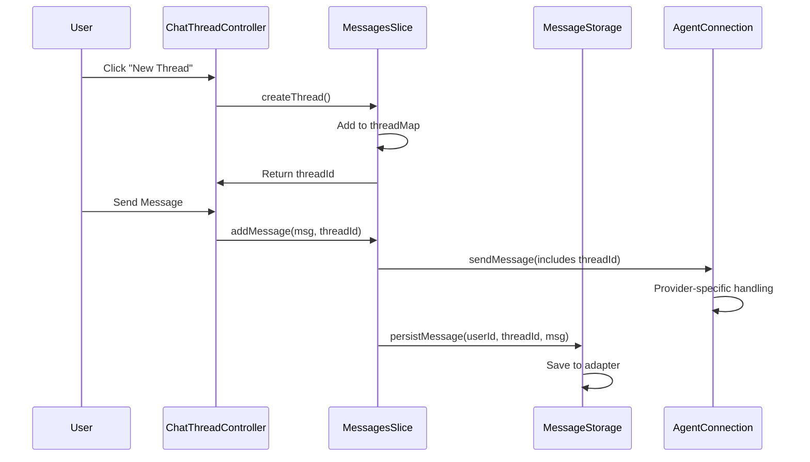

# Cedar OS Thread System - Integration Summary

## ✅ Successfully Integrated Components

### 1. **ChatThreadController + FloatingCedarChat**

```tsx
// Usage in FloatingCedarChat
<FloatingCedarChat
	showThreadController={true} // Enables thread UI
	// Thread icon appears in header
	// Click to toggle thread list
/>
```

### 2. **Message Storage Integration**

The thread system seamlessly integrates with `messageStorage.ts`:

- **Persistence**: Each thread's messages are saved with `(userId, threadId, message)`
- **Loading**: On app start, threads are loaded and the last active thread is selected
- **Thread Metadata**: Tracks thread ID, title, and last updated timestamp
- **Auto-creation**: If no threads exist, a default thread is created automatically

### 3. **Agent Connection Integration**

All providers work with the thread system:

#### **Mastra Provider**

```typescript
// Automatically includes threadId in requests
sendMessage() → includes threadId: mainThreadId
// Server can maintain thread-specific context
```

#### **OpenAI/Anthropic/AI SDK**

```typescript
// Thread management is client-side only
// No threadId sent to API
// Messages organized locally by thread
```

#### **Custom Providers**

```typescript
// Optionally receives threadId
sendMessage() → includes threadId if backend supports it
```

### 4. **How It All Works**



## 🔑 Key Features

1. **Backward Compatible**: Existing code continues to work without changes
2. **Thread Isolation**: Messages are completely isolated between threads
3. **Automatic Syncing**: The `messages` array always reflects the current thread
4. **Provider Agnostic**: Works with all LLM providers
5. **Persistent**: Messages survive page refreshes with storage adapters

## 📝 Implementation Details

### State Structure

```typescript
// In messagesSlice
{
  threadMap: {
    'default-thread': { id, lastLoaded, messages: [] },
    'thread-123': { id, lastLoaded, messages: [] },
    // ... more threads
  },
  mainThreadId: 'thread-123',  // Current active thread
  messages: [...],              // Synced with current thread
}
```

### Provider Behavior

- **Mastra**: Receives `threadId` → Can maintain server-side thread context
- **OpenAI/Anthropic**: No `threadId` sent → Client-side management only
- **AI SDK**: No `threadId` sent → Client-side management only
- **Custom**: Optional `threadId` → Based on backend implementation

### Storage Flow

1. User sends message → Added to `threadMap[mainThreadId]`
2. Message persisted via `messageStorage.persistMessage()`
3. Thread metadata updated (title, lastUpdated)
4. On reload → Threads loaded, messages restored

## 🚀 Usage Examples

### Basic Setup

```tsx
import { FloatingCedarChat } from 'cedar-os-components';

<CedarCopilot
	llmProvider={{ provider: 'mastra', baseURL: '...' }}
	messageStorage={{ type: 'local' }}
	userId='user-123'>
	<FloatingCedarChat showThreadController={true} title='My Chat' />
</CedarCopilot>;
```

### Programmatic Control

```typescript
import { useThreadController } from 'cedar-os';

const { createThread, switchThread, deleteThread } = useThreadController();

// Create and switch to new thread
const newId = createThread();
switchThread(newId);
```

## ✨ Benefits

1. **Organized Conversations**: Keep different topics in separate threads
2. **Context Preservation**: Each thread maintains its own context
3. **Better UX**: Users can manage multiple conversations
4. **Server Integration**: Mastra can leverage thread IDs for better context
5. **Flexible Storage**: Works with any storage adapter

## 🎯 Testing Results

All integration tests pass:

- ✅ Thread creation and switching
- ✅ Message isolation between threads
- ✅ Current thread syncing
- ✅ Storage integration ready
- ✅ Provider integration working

The thread system is production-ready and fully integrated!
